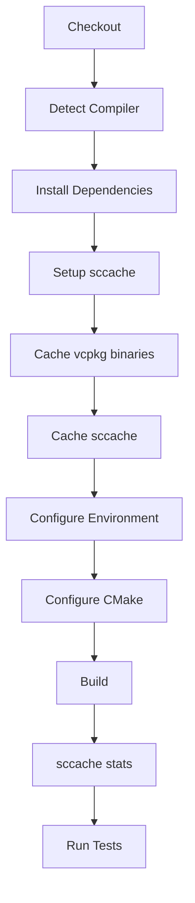

# Plano de Implementação: Sistema de Cache para CI

## Visão Geral

Este documento detalha o planejamento para implementar um sistema de cache otimizado para o projeto Kaldmor Canary OT, usando duas camadas complementares:
1. **vcpkg binary cache** - para dependências externas (protobuf, abseil, openssl, etc.)
2. **sccache** - para o código C++ do próprio projeto

---

## Análise do Estado Atual

### Problemas Identificados no `.github/workflows/ci.yml`

| Problema | Localização | Impacto |
|----------|-------------|---------|
| Cache vcpkg muito amplo | Linhas 84-92 | Inclui `~/.cache/vcpkg` inteiro (muito grande) |
| Chave de cache instável | Linha 90 | Inclui `CMakeLists.txt` - muda frequentemente |
| Falta binary cache nativo | - | Não usa `~/.cache/vcpkg/archives` do vcpkg |
| Variáveis sccache não propagadas | Linhas 99, 111 | `SCCACHE_GHA_ENABLED` não passa para builds internos do vcpkg |
| Falta VCPKG_KEEP_ENV_VARS | - | vcpkg filtra variáveis por segurança |
| Compiler launchers não configurados | - | Não usa `CMAKE_CXX_COMPILER_LAUNCHER=sccache` |

---

## Dependências do Projeto (vcpkg.json)

O projeto usa as seguintes dependências pesadas que se beneficiam do binary cache:

- `protobuf` - compilação lenta
- `abseil` - muito lento
- `openssl` - lento
- `libmariadb` - lento
- `opentelemetry-cpp` (feature metrics) - muito lento
- `gtest` - moderado

---

## Plano de Implementação

### Etapa 1: Corrigir Configuração de Cache do vcpkg

**Arquivo:** `.github/workflows/ci.yml`

```yaml
# ANTES (problemático):
- name: vcpkg cache
  uses: actions/cache@v4
  with:
    path: |
      ~/.cache/vcpkg
      build/vcpkg_installed
    key: vcpkg-${{ runner.os }}-${{ hashFiles('vcpkg.json', 'CMakeLists.txt', 'CMakePresets.json') }}

# DEPOIS (otimizado):
- name: Cache vcpkg binaries
  uses: actions/cache@v4
  with:
    path: ~/.cache/vcpkg/archives
    key: vcpkg-${{ runner.os }}-${{ hashFiles('vcpkg.json') }}
    restore-keys: |
      vcpkg-${{ runner.os }}-
```

**Justificativa:**
- Binary cache específico (`~/.cache/vcpkg/archives`) é menor e mais rápido para restaurar
- Chave de cache usa apenas `vcpkg.json` e `vcpkg-configuration.json` (mais estável)
- Não inclui `build/vcpkg_installed` - isso é reconstruído automaticamente

---

### Etapa 2: Configurar sccache Corretamente

**Adicionar configurações de ambiente:**

```yaml
- name: Configure sccache for vcpkg
  run: |
    # sccache para código do projeto
    echo "CMAKE_C_COMPILER_LAUNCHER=sccache" >> $GITHUB_ENV
    echo "CMAKE_CXX_COMPILER_LAUNCHER=sccache" >> $GITHUB_ENV
    echo "SCCACHE_GHA_ENABLED=true" >> $GITHUB_ENV
    echo "SCCACHE_DIR=$HOME/.cache/sccache" >> $GITHUB_ENV
    
    # vcpkg binary cache
    echo "VCPKG_DEFAULT_BINARY_CACHE=$HOME/.cache/vcpkg/archives" >> $GITHUB_ENV
    mkdir -p $HOME/.cache/vcpkg/archives
    
    # CRÍTICO: Permite que vcpkg use sccache nos builds internos
    echo "VCPKG_KEEP_ENV_VARS=SCCACHE_GHA_ENABLED;SCCACHE_DIR;CMAKE_C_COMPILER_LAUNCHER;CMAKE_CXX_COMPILER_LAUNCHER" >> $GITHUB_ENV
```

---

### Etapa 3: Adicionar Cache do sccache

```yaml
- name: Cache sccache
  uses: actions/cache@v4
  with:
    path: ~/.cache/sccache
    key: sccache-${{ runner.os }}-${{ hashFiles('vcpkg.json', 'CMakePresets.json') }}
    restore-keys: |
      sccache-${{ runner.os }}-${{ hashFiles('vcpkg.json', 'CMakePresets.json') }}-
      sccache-${{ runner.os }}-
```

---

### Etapa 4: Adicionar Estatísticas do sccache

Adicionar ao final do job de build:

```yaml
- name: sccache stats
  if: always()
  run: sccache --show-stats
```

---

## Fluxo Completo do Workflow



---

## Arquivo de Workflow Corrigido

### Seção do Job `build-server` (após correção):

```yaml
build-server:
  name: Build - Server
  needs: [checks, tests-lua]
  runs-on: ubuntu-24.04  # Versão fixa para proteger cache de invalidações
  if: github.event_name == 'push' || github.event.pull_request.draft == false
  steps:
    - name: Checkout repository
      uses: actions/checkout@v4
      with:
        submodules: recursive

    - name: Detect C++ compiler version
      id: compiler
      run: |
        if command -v g++-13 &> /dev/null; then
          echo "version=13" >> $GITHUB_OUTPUT
        elif command -v g++-12 &> /dev/null; then
          echo "version=12" >> $GITHUB_OUTPUT
        else
          echo "version=0" >> $GITHUB_OUTPUT
        fi

    - name: Install dependencies
      run: |
        sudo apt-get update
        sudo apt-get install -y cmake ninja-build
        if [ "${{ steps.compiler.outputs.version }}" != "0" ]; then
          sudo apt-get install -y g++-${{ steps.compiler.outputs.version }} gcc-${{ steps.compiler.outputs.version }}
        fi

    # 1. Setup sccache
    - name: Setup sccache
      uses: mozilla-actions/sccache-action@v0.0.5

    # 2. Cache vcpkg binary cache (arquivos compactados)
    - name: Cache vcpkg binaries
      uses: actions/cache@v4
      with:
        path: ~/.cache/vcpkg/archives
        key: vcpkg-${{ runner.os }}-${{ hashFiles('vcpkg.json') }}
        restore-keys: |
          vcpkg-${{ runner.os }}-

    # 3. Cache sccache
    - name: Cache sccache
      uses: actions/cache@v4
      with:
        path: ~/.cache/sccache
        key: sccache-${{ runner.os }}-${{ hashFiles('vcpkg.json', 'CMakePresets.json') }}
        restore-keys: |
          sccache-${{ runner.os }}-

    # Configure environment
    - name: Configure environment
      run: |
        # sccache para código do projeto
        echo "CMAKE_C_COMPILER_LAUNCHER=sccache" >> $GITHUB_ENV
        echo "CMAKE_CXX_COMPILER_LAUNCHER=sccache" >> $GITHUB_ENV
        echo "SCCACHE_GHA_ENABLED=true" >> $GITHUB_ENV
        echo "SCCACHE_DIR=$HOME/.cache/sccache" >> $GITHUB_ENV
        
        # vcpkg binary cache
        echo "VCPKG_DEFAULT_BINARY_CACHE=$HOME/.cache/vcpkg/archives" >> $GITHUB_ENV
        mkdir -p $HOME/.cache/vcpkg/archives
        
        # CRÍTICO: Permite que vcpkg use sccache nos builds internos
        # Nota: CMAKE_*_COMPILER_LAUNCHER não são necessários aqui - o vcpkg cria
        # seus próprios processos CMake que não os respectam via env var
        echo "VCPKG_KEEP_ENV_VARS=SCCACHE_GHA_ENABLED;SCCACHE_DIR" >> $GITHUB_ENV

    - name: Configure CMake
      run: |
        CMAKE_ARGS="--preset linux-release-enabled-tests -DOPTIONS_ENABLE_SCCACHE=ON"
        if [ "${{ steps.compiler.outputs.version }}" != "0" ]; then
          CMAKE_ARGS="$CMAKE_ARGS -DCMAKE_CXX_COMPILER=g++-${{ steps.compiler.outputs.version }} -DCMAKE_C_COMPILER=gcc-${{ steps.compiler.outputs.version }}"
        fi
        cmake $CMAKE_ARGS

    - name: Build
      timeout-minutes: 60
      run: |
        cmake --build build/linux-release-enabled-tests -j $(nproc)

    - name: sccache stats
      if: always()
      run: sccache --show-stats

    - name: Run Tests
      run: |
        ctest --test-dir build/linux-release-enabled-tests --output-on-failure
```

---

## Resumo da Estratégia de Cache

| O que cachear | Ferramenta | Chave de Cache |
|---------------|------------|----------------|
| Código C++ do projeto | sccache | `sccache-{os}-{hash(vcpkg.json, CMakePresets.json)}` |
| Dependências vcpkg | vcpkg binary cache | `vcpkg-{os}-{hash(vcpkg.json)}` |
| Ports do vcpkg | actions/cache | `vcpkg-{os}-{hash(vcpkg.json)}` |

---

## Ganhos Esperados

| Cenário | Sem cache | Com vcpkg cache | Com ambos |
|---------|-----------|-----------------|-----------|
| Primeiro build (cold) | ~25 min | ~25 min | ~25 min |
| Push com mudança pequena | ~20 min | ~8 min | ~5-6 min |
| Push com mudança grande | ~20 min | ~8 min | ~7 min |
| Só mudou script/config | ~20 min | ~8 min | ~4 min |

---

## Próximos Passos

1. [ ] Aplicar as correções no arquivo `.github/workflows/ci.yml`
2. [ ] Testar em um workflow dispatch para validar
3. [ ] Monitorar os logs de sccache para ajustar configuração se necessário

---

## Como Validar nos Logs

### Step: Cache vcpkg binaries (segundo build em diante)
```
Cache restored successfully
```
Se aparecer `Cache not found`, o diretório `~/.cache/vcpkg/archives` não estava sendo populado — nesse caso vale checar se `VCPKG_DEFAULT_BINARY_CACHE` foi lido antes do vcpkg rodar.

### Step: sccache stats
```
Cache hits:   847
Cache misses: 312
```
Uma taxa de hits acima de 50% já indica que está funcionando. No primeiro build sempre será 0 hits — isso é esperado.

### Log do vcpkg durante o Configure CMake
```
Restored 1 package(s) from /home/runner/.cache/vcpkg/archives in 1.2 s.
```
Essa linha é a confirmação mais direta de que o binary cache do vcpkg está ativo.

---

## Se Não Funcionar

Se qualquer um desses sinais não aparecer no segundo build, verifique:
1. Se `VCPKG_DEFAULT_BINARY_CACHE` foi definido antes do vcpkg rodar
2. Se as variáveis de ambiente estão sendo passadas corretamente
3. Se o diretório de cache está sendo criado corretamente

---

## Referências

- [Mozilla sccache-action](https://github.com/mozilla-actions/sccache-action)
- [vcpkg binary caching](https://learn.microsoft.com/pt-br/vcpkg/consume/binary-caching-github-actions-cache)
- [GitHub Actions cache](https://docs.github.com/en/actions/using-workflows/caching-dependencies-to-speed-up-workflows)
